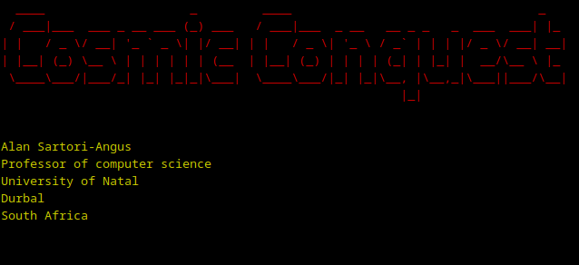

# Cosmic Conquest 1982

This is a fork of Original project from [RickCarlino here](https://github.com/RickCarlino/Cosmic-Conquest-1982).

A copy of it is still in local [Original](./Original/) directory too. See [Original README](./Original/README.md) for details.

# Forked version 
```
        ___   _   ____  
__   __/ _ \ / | |___ \ 
\ \ / / | | || |   __) |
 \ V /| |_| || |_ / __/ 
  \_/  \___(_)_(_)_____|
                        
```


# Why forking ?

Project seems abandoned since about 2 years now. Forked on Wed Jun 21

- [ ] Modernize all the code & remove some useless words that are no more needed here
- [X] code documentation is currently so bad...
- [X] there are no score file generated
- [ ] will try to do some improvement too
- [X] games is not starting automatically on load 
- [X] key map is not pleasant to me 
- [X] missing LICENSE file as there was originally no file the [unlicensed](./LICENSE) is the one to use.
- [X] missing a quit in game to go back to system 
- [X] no gforth version checking 
- [X] there are no colors 
- [X] why is there 2 key press needed on start 
- [X] will include original magazine notes too 



# References

[Full instructions are available in the original magazine article.](https://archive.org/details/byte-magazine-1982-12/page/n125/mode/2up)

This is a re-creation of a [real-time strategy game published in BYTE Magazine in 1982](https://archive.org/details/byte-magazine-1982-12/page/n131/mode/1up?q=cosmic+conquest). The original version of the game was distributed in printed form for users to manually type into their Apple II computers. It is credited as one of the first real-time strategy computer games. The game was authored in a flavor of FIGForth for the Apple II, possibly FIGForth '78. The exact platform is unknown at this time.

Attempts at emulation have not gone well because we cannot determine the exact Forth version originally used. The source code has been updated to run on a modern Forth system (GForth).

# Contents of This Repo

 * `Original` - repo as is before forking it
 * `cosmic_conquest_modern.fs` - "40Th Anniversary Edition". A modernized version of the game, playable on GForth.
 * `modernize.fs` - also comes from fork


# How to Run - TO BE CHANGED

1. Install [GForth](https://gforth.org/). Nearly any version will work and it is verified to work on GForth >= 0.7.3
1. Run the source code via `gforth cosmic_conquest_modern.fs`.
1. Once GForth is running, type `CONQUEST` to start the game.

# How To Play - TO BE CHANGED

**COMMANDS ARE CASE SENSITIVE.** In the original Apple II, this did not matter. On modern systems, it does. Keep that in mind as you enter commands.

When you open the game, you will be prompted to press "any key" twice. This is used for generation of a random seed and will affect the structure of the game's universe.

Just run 
```
./go.sh
``` 

[VIDEO](https://www.youtube.com/watch?v=btgiQU_NxUk) _in french so use youtube translator if needed_

Key controls:

 * `J`, `L`, `I`, `k` - Directional controls - standard VIM mode :) 
 * `T` - **T**ax your planets
 * `G` - **L**and on a planet - Ground
 * `R` - **I**nformation - Radar
 * `F` - **F**ire / attack enemy
 * `C` - Switch to **O**ther fleet - Change 

[Full instructions are available in the original magazine article.](https://archive.org/details/byte-magazine-1982-12/page/n125/mode/2up)

# Contributors on forked version 

Special thanks goes to the folks who made this restoration possible:

 * Alan Sartori-Angus - Original author of the game in 1982.
 * [Gordon JC Pearce](https://github.com/gordonjcp) - Ported the historic 1982 source code to GForth.
 * [tmr4](https://github.com/tmr4) - Data entry of original sources.
 * [Rick Carlino](https://github.com/RickCarlino/) - Documentation, proofing, data entry.

